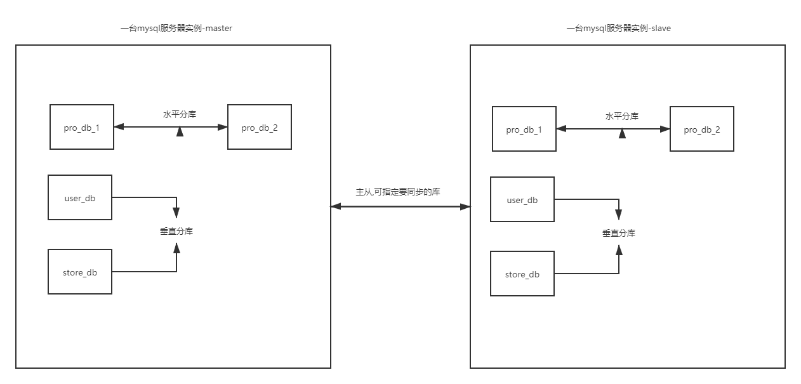

#### 垂直分表
充分发挥热门数据的操作效率，高效率字段不会被低效率字段所拖累
- 把不常用的字段单独放在一张表
- 把text、blob等大字段拆分出来放在附表中
- 经常组合查询的列放在一种表中
#### 垂直分库
根据业务划分，将数据表分布到不同的数据库中，每个数据库的业务独立

#### 公共表
实际的应用场景中，参数表、数据字典表（固定表）等都是数据量较小，变动少，而且属于高频联合查询的依赖表，例如地址区域表。
可以将这类表在每个数据库都保存一份，**所有对公共表的更新操作都同时发送到所有分库执行。**

#### docker创建mysql主从（一主一从）
参考文档<<mysql主从配置.md>>
#### sharing-jdbc 读写分离原理
Sharding-JDBC 实现读写分离则是根据sql 语句语义分析，当 sql 语句有 insert、update、delete 时，Sharding-JDBC 就把这次操作在主数据库上执行；
当 sql 语句有 select 时，就会把这次操作在从数据库上执行，从而实现读写分离过程。
但 Sharding-JDBC 并不会做数据同步，数据同步是配置 MySQL 后由 MySQL 自己完成的。(所以需要配置主从)

#### ShardingSphere-Proxy docker安装
```
docker pull shardingsphere/shardingsphere-proxy
docker run -d -v D:\down_package\maven_work\sharing-jdbc\docker\sharing-proxy\conf:/opt/shardingsphere-proxy/conf -e PORT=3308 -p13308:3308 apache/shardingsphere-proxy:latest
```
#### 水平分表
```yaml
#数据源
spring.shardingsphere.datasource.names=m1
spring.shardingsphere.datasource.m1.type=com.alibaba.druid.pool.DruidDataSource
spring.shardingsphere.datasource.m1.driver-class-name=com.mysql.cj.jdbc.Driver
spring.shardingsphere.datasource.m1.url=jdbc:mysql://localhost:3308/edu_db_1?useUnicode=true&characterEncoding=UTF-8&autoReconnect=true&failOverReadOnly=false
spring.shardingsphere.datasource.m1.username=root
spring.shardingsphere.datasource.m1.password=root
#数据节点 m1.t_order_1  m1.t_order_2  这里将t_order改为abc是一样的 那么生成的sql就是insert into abc 
#然后share-jdbc就会找到这个abc对应的配置得到节点->m1.t_order_1  m1.t_order_2 
spring.shardingsphere.sharding.tables.t_order.actual-data-nodes=m1.t_order_->{1..2}
#如果是水平分库 则数据节点分布如下 
#spring.shardingsphere.sharding.tables.t_order.actual-data-nodes=m$->{1..2}.t_order_$->{1..2}
#主键生成规则
spring.shardingsphere.sharding.tables.t_order.key-generator.column=order_id
spring.shardingsphere.sharding.tables.t_order.key-generator.type=SNOWFLAKE
#分片策略(包含分片键和分片算法,这个分片算法指明了真正的表) 根据order_id进行分片  
spring.shardingsphere.sharding.tables.course.table-strategy.inline.sharding-column=order_id
spring.shardingsphere.sharding.tables.course.table-strategy.inline.algorithm-expression=t_order_->{order_id % 2 + 1}
```
##### 水平分表执行流程:
通过日志分析，Sharding-JDBC在拿到用户要执行的sql之后干了哪些事儿：
（1）解析sql，获取片键值，在本例中是order_id
（2）Sharding-JDBC通过规则配置 t_order_$->{order_id % 2 + 1}，知道了当order_id为偶数时，应该往t_order_1表插数据，为奇数时，往t_order_2插数据。
（3）于是Sharding-JDBC根据order_id的值改写sql语句，改写后的SQL语句是真实所要执行的SQL语句。
（4）执行改写后的真实sql语句
（5）将所有真正执行sql的结果进行汇总合并，返回。
#### 基本概念
- 逻辑表:水平拆分的数据库（表）的相同逻辑和数据结构表的总称 t_order_0 到 t_order_9，他们的逻辑表名为 t_order。
- 真实表:在分片的数据库中真实存在的物理表。即上个示例中的 t_order_0 到 t_order_9
- 数据节点:数据分片的最小单元。由数据源名称和数据表组成，例：ds_0.t_order_0
- 绑定表:指分片规则一致的主表和子表。例如：t_order 表和 t_order_item 表，均按照 order_id 分片，则此两张表互为绑定表关系。
绑定表之间的多表关联查询不会出现笛卡尔积关联，关联查询效率将大大提升
- 公共表(广播表):指所有的分片数据源中都存在的表，表结构和表中的数据在每个数据库中均完全一致。适用于数据量不大且需要与海量数据的表进行关联查询的场景，例如：字典表。
#### sharding-jdbc sql执行原理
- sql解析:解析过程分为词法解析和语法解析。 词法解析器用于将 SQL 拆解为不可再分的原子符号，称为 Token。并根据不同数据库方言所提供的字典，将其归类为关键字，表达式，字面量和操作符。 再使用语法解析器将词法解析器的输出转换为抽象语法树。
- sql路由:根据逻辑表名和分片策略,这个sql最终要在那个数据节点执行的过程称之为路由
- sql改写:SQL 改写用于将逻辑 SQL 改写为在真实数据库中可以正确执行的 SQL
- sql执行:多个节点进行执行
- 结果归并:将从各个数据节点获取的多数据结果集，组合成为一个结果集并正确的返回至请求客户端，称为结果归并
#### 水平分库
分库策略语法:
```yaml
分库策略定义方式如下：
#分库策略，如何将一个逻辑表映射到多个数据源
spring.shardingsphere.sharding.tables.<逻辑表名称>.database‐strategy.<分片策略>.<分片策略属性名>= #分片策略属性值
#分表策略，如何将一个逻辑表映射为多个实际表
spring.shardingsphere.sharding.tables.<逻辑表名称>.table‐strategy.<分片策略>.<分片策略属性名>= #分片策略属性值

```
```yaml
#定义多个数据源
# 配置第一个数据源的具体内容，包含连接池，驱动，地址，用户名，密码
spring.shardingsphere.datasource.m1.type=com.alibaba.druid.pool.DruidDataSource
spring.shardingsphere.datasource.m1.driver-class-name=com.mysql.cj.jdbc.Driver
spring.shardingsphere.datasource.m1.url=jdbc:mysql://localhost:3308/order_db_1?useUnicode=true&characterEncoding=UTF-8&autoReconnect=true&failOverReadOnly=false
spring.shardingsphere.datasource.m1.username=root
spring.shardingsphere.datasource.m1.password=root

# 配置第二个数据源的具体内容，包含连接池，驱动，地址，用户名，密码
spring.shardingsphere.datasource.m2.type=com.alibaba.druid.pool.DruidDataSource
spring.shardingsphere.datasource.m2.driver-class-name=com.mysql.cj.jdbc.Driver
spring.shardingsphere.datasource.m2.url=jdbc:mysql://localhost:3308/order_db_2?useUnicode=true&characterEncoding=UTF-8&autoReconnect=true&failOverReadOnly=false
spring.shardingsphere.datasource.m2.username=root
spring.shardingsphere.datasource.m2.password=root

# 分库策略，以user_id为分片键，分片策略为user_id % 2 + 1，user_id为偶数操作m1数据源，否则操作m2。
#inline:一种内置的分片策略
spring.shardingsphere.sharding.tables.t_order.database‐strategy.inline.sharding‐column = user_id
#根据user_id找到数据库
spring.shardingsphere.sharding.tables.t_order.database‐strategy.inline.algorithm‐expression =m$‐>{user_id % 2 + 1}
```
当配置好分库之后,会先根据user_id路由到某一具体库,再根据order_id路由到具体的表,并且会根据条件来判断所执行的sql是否需要指定在多库多表

#### 垂直分库
专库专用
```yaml
#数据源
spring.shardingsphere.datasource.m0.type=com.alibaba.druid.pool.DruidDataSource
spring.shardingsphere.datasource.m0.driver-class-name=com.mysql.cj.jdbc.Driver
spring.shardingsphere.datasource.m0.url=jdbc:mysql://localhost:3308/user_db?useUnicode=true&characterEncoding=UTF-8&autoReconnect=true&failOverReadOnly=false
spring.shardingsphere.datasource.m0.username=root
spring.shardingsphere.datasource.m0.password=root

#数据节点  该m0数据源中只有一个数据库t_user 直接写死即可
spring.shardingsphere.sharding.tables.t_user.actual-data-nodes=m0.t_user

#没有分库 所有没有分库策略

#主键生成策略
# t_user配置主键的生成策略
spring.shardingsphere.sharding.tables.t_user.key-generator.column=user_id
spring.shardingsphere.sharding.tables.t_user.key-generator.type=SNOWFLAKE

#表的分片策略
spring.shardingsphere.sharding.tables.t_user.table-strategy.inline.sharding-column=user_id
#只有一个t_user 没有表达式 直接指定t_user
spring.shardingsphere.sharding.tables.t_user.table-strategy.inline.algorithm-expression=t_user
```
可以将垂直分库后的库,再次进行水平分库,即专库专用后,再根据分库策略分出几个库来
#### 公共表
在每个数据节点都有一份,通过路由,向每一个数据节点执行sql
```yaml
# 公共表配置->所有对公共表的更新操作都同时发送到所有分库执行
spring.shardingsphere.sharding.broadcast-tables=t_dict
# 配置主键的生成策略
spring.shardingsphere.sharding.tables.t_dict.key-generator.column=dict_id
spring.shardingsphere.sharding.tables.t_dict.key-generator.type=SNOWFLAKE
```
#### 读写分离
**Sharding-JDBC读写分离则是根据SQL语义的分析，将读操作和写操作分别路由至主库与从库**。它提供透明化读写
分离，让使用方尽量像使用一个数据库一样使用主从数据库集群。
Sharding-JDBC提供一主多从的读写分离配置，可独立使用，也可配合分库分表使用，同一线程且同一数据库连接
内，如有写入操作，以后的读操作均从主库读取，用于保证数据一致性。Sharding-JDBC不提供主从数据库的数据同步功能，需要采用其他机制支持。
```yaml
主从数据库数据源:
spring.shardingsphere.datasource.m0.type=com.alibaba.druid.pool.DruidDataSource
spring.shardingsphere.datasource.m0.driver-class-name=com.mysql.cj.jdbc.Driver
spring.shardingsphere.datasource.m0.url=jdbc:mysql://localhost:3308/user_db?useUnicode=true&characterEncoding=UTF-8&autoReconnect=true&failOverReadOnly=false
spring.shardingsphere.datasource.m0.username=root
spring.shardingsphere.datasource.m0.password=root

# user 从库
spring.shardingsphere.datasource.s0.type=com.alibaba.druid.pool.DruidDataSource
spring.shardingsphere.datasource.s0.driver-class-name=com.mysql.cj.jdbc.Driver
spring.shardingsphere.datasource.s0.url=jdbc:mysql://localhost:3307/user_db?useUnicode=true&characterEncoding=UTF-8&autoReconnect=true&failOverReadOnly=false
spring.shardingsphere.datasource.s0.username=root
spring.shardingsphere.datasource.s0.password=root

# 主库从库逻辑数据源定义 ds0 为 user_db  定义主库 定义从库   ds0:逻辑名 任意
spring.shardingsphere.sharding.master-slave-rules.ds0.master-data-source-name=m0
spring.shardingsphere.sharding.master-slave-rules.ds0.slave-data-source-names=s0

#数据节点: ds0:对应上面的ds0逻辑名
spring.shardingsphere.sharding.tables.t_user.actual-data-nodes=ds0.t_user
```
#### 综合案例


###### 数据源

六个数据源  store_db,pro_db(忽略user_db)以及他们的slave   m0,s1,s2  
数据源对应的是某一个数据库
```yaml
#m0:store_db
spring.shardingsphere.datasource.m0.type=com.alibaba.druid.pool.DruidDataSource
spring.shardingsphere.datasource.m0.driver-class-name=com.mysql.cj.jdbc.Driver
spring.shardingsphere.datasource.m0.url=jdbc:mysql://localhost:3308/store_db?useUnicode=true&characterEncoding=UTF-8&autoReconnect=true&failOverReadOnly=false
spring.shardingsphere.datasource.m0.username=root
spring.shardingsphere.datasource.m0.password=root
#s0:store_db
spring.shardingsphere.datasource.s0.type=com.alibaba.druid.pool.DruidDataSource
spring.shardingsphere.datasource.s0.driver-class-name=com.mysql.cj.jdbc.Driver
spring.shardingsphere.datasource.s0.url=jdbc:mysql://localhost:3307/store_db?useUnicode=true&characterEncoding=UTF-8&autoReconnect=true&failOverReadOnly=false
spring.shardingsphere.datasource.s0.username=root
spring.shardingsphere.datasource.s0.password=root
#m1:pro_db_1
spring.shardingsphere.datasource.m0.type=com.alibaba.druid.pool.DruidDataSource
spring.shardingsphere.datasource.m0.driver-class-name=com.mysql.cj.jdbc.Driver
spring.shardingsphere.datasource.m0.url=jdbc:mysql://localhost:3308/pro_db_1?useUnicode=true&characterEncoding=UTF-8&autoReconnect=true&failOverReadOnly=false
spring.shardingsphere.datasource.m0.username=root
spring.shardingsphere.datasource.m0.password=root
#s1:pro_db_1
spring.shardingsphere.datasource.s0.type=com.alibaba.druid.pool.DruidDataSource
spring.shardingsphere.datasource.s0.driver-class-name=com.mysql.cj.jdbc.Driver
spring.shardingsphere.datasource.s0.url=jdbc:mysql://localhost:3307/pro_db_1?useUnicode=true&characterEncoding=UTF-8&autoReconnect=true&failOverReadOnly=false
spring.shardingsphere.datasource.s0.username=root
spring.shardingsphere.datasource.s0.password=root
#m2:pro_db_2
spring.shardingsphere.datasource.m0.type=com.alibaba.druid.pool.DruidDataSource
spring.shardingsphere.datasource.m0.driver-class-name=com.mysql.cj.jdbc.Driver
spring.shardingsphere.datasource.m0.url=jdbc:mysql://localhost:3308/pro_db_2?useUnicode=true&characterEncoding=UTF-8&autoReconnect=true&failOverReadOnly=false
spring.shardingsphere.datasource.m0.username=root
spring.shardingsphere.datasource.m0.password=root
#s2:pro_db_2
spring.shardingsphere.datasource.m0.type=com.alibaba.druid.pool.DruidDataSource
spring.shardingsphere.datasource.m0.driver-class-name=com.mysql.cj.jdbc.Driver
spring.shardingsphere.datasource.m0.url=jdbc:mysql://localhost:3307/pro_db_2?useUnicode=true&characterEncoding=UTF-8&autoReconnect=true&failOverReadOnly=false
spring.shardingsphere.datasource.m0.username=root
spring.shardingsphere.datasource.m0.password=root
#主从逻辑数据源对应 这里的ds0为自定义 ds1 ds2同理
spring.shardingsphere.sharding.master-slave-rules.ds0.master-data-source-name=m0
spring.shardingsphere.sharding.master-slave-rules.ds0.slave-data-source-names=s0

spring.shardingsphere.sharding.master-slave-rules.ds1.master-data-source-name=m1
spring.shardingsphere.sharding.master-slave-rules.ds1.slave-data-source-names=s1

spring.shardingsphere.sharding.master-slave-rules.ds2.master-data-source-name=m2
spring.shardingsphere.sharding.master-slave-rules.ds2.slave-data-source-names=s2
#分库策略(水平)pro_db  
#根据店铺id区分 该字段在商品信息和商品描述中都有
# 默认分库策略，以store_info_id为分片键，分片策略为store_info_id % 2 + 1，也就是store_info_id为双数的数据进入ds1，为单数的进入ds2
#default‐database‐strategy:这里不用配具体的表了,因为两个表都有store_info_id
spring.shardingsphere.sharding.default‐database‐strategy.inline.sharding‐column = store_info_id
spring.shardingsphere.sharding.default‐database‐strategy.inline.algorithm‐expression = ds$‐>{store_info_id % 2 + 1}

#分表策略 对逻辑表进行分表策略
#store_info(无水平拆分)
# store_info分表策略，固定分配至ds0的store_info真实表  在主从环境下 ds0包括了m0和s0(读写分离)
spring.shardingsphere.sharding.tables.store_info.actual‐data‐nodes = ds$‐>{0}.store_info 
spring.shardingsphere.sharding.tables.store_info.table‐strategy.inline.sharding‐column = id
#分表策略直接是一个表,不需要要取模算法
spring.shardingsphere.sharding.tables.store_info.table‐strategy.inline.algorithm‐expression =store_info

# product_info分表策略，分布在ds1,ds2的product_info_1 product_info_2表 ，
#分片策略为product_info_id% 2 + 1，product_info_id生成为雪花算法，为双数的数据进入product_info_1表，为单数的进入product_info_2表
#四个数据节点: ds0_product_info_1 ds0_product_info_2  ds1_product_info_1 ds1_product_info_2
spring.shardingsphere.sharding.tables.product_info.actual‐data‐nodes = ds$‐>{1..2}.product_info_$‐>{1..2}
spring.shardingsphere.sharding.tables.product_info.table‐strategy.inline.sharding‐column = product_info_id
spring.shardingsphere.sharding.tables.product_info.table‐strategy.inline.algorithm‐expression =product_info_$->{product_info_id%2+1}
#主键生成规则
spring.shardingsphere.sharding.tables.product_info.key‐generator.column=product_info_id
spring.shardingsphere.sharding.tables.product_info.key‐generator.type=SNOWFLAKE

#product_descript分表策略:分布在ds1,ds2的product_descript_1 product_descript_2表  product_descript与product_info是互为绑定表,分片规则一致
#分片策略为product_info_id % 2 + 1，id生成为雪花算法，product_info_id为双数的数据进入product_descript_1表，为单数的进入product_descript_2表
spring.shardingsphere.sharding.tables.product_descript.actual‐data‐nodes = ds$‐>{1..2}.product_info_$‐>{1..2}
#绑定表使用相同的分片键
spring.shardingsphere.sharding.tables.product_descript.table‐strategy.inline.sharding‐column = product_info_id
spring.shardingsphere.sharding.tables.product_descript.table‐strategy.inline.algorithm‐expression =product_info_$->{product_info_id%2+1}
#主键生成规则
spring.shardingsphere.sharding.tables.product_descript.key‐generator.column=id
spring.shardingsphere.sharding.tables.product_descript.key‐generator.type=SNOWFLAKE

# 设置product_info,product_descript为绑定表 表明对应上面的逻辑表名 避免笛卡尔积
spring.shardingsphere.sharding.binding‐tables[0] = product_info,product_descript
#spring.shardingsphere.sharding.binding‐tables[1] = product_info,product_descript

# 设置region为广播表(公共表)，每次更新操作会发送至所有数据源
spring.shardingsphere.sharding.broadcast‐tables=region

#所有的表都要配分表策略(除了公共表) 只有一张表时可写死
#垂直分库是在设计时就做的事情,当垂直分库做好后,配置中没用垂直分库的策略,只需要配置数据源 然后进行分表配置即可 参考上例store_db
```
当mybaits与shard-jdbc同时指定了主键生成规则,则使用shard-jdbc生成规则
